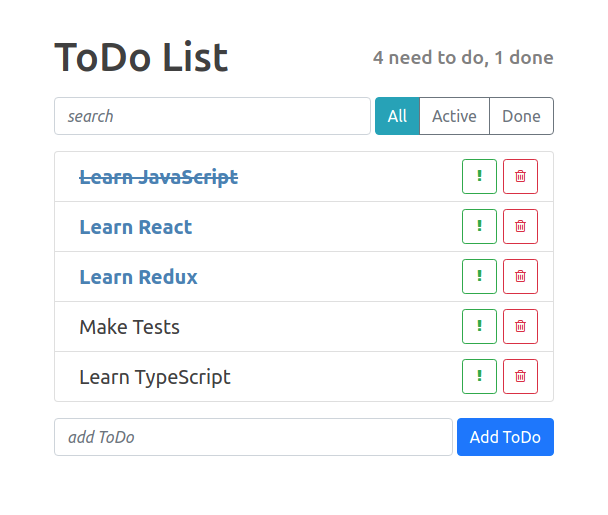

# React-ToDo-app

> React training-project from udemy course
>
> Mini todo-list app

## What I've learned

- Class & Functional React components
- props, state, setState
- onClick
- custom Events
- onChange, onSubmit
